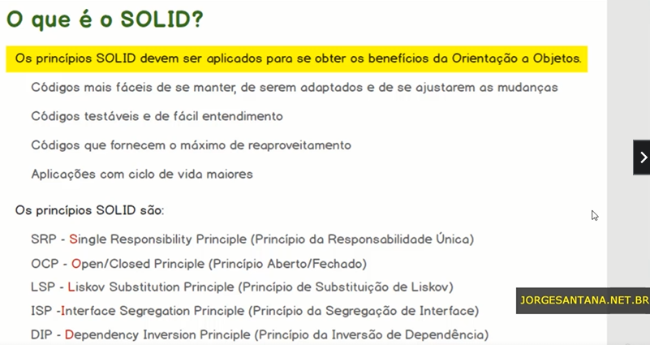
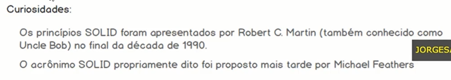
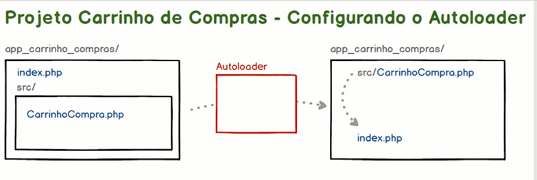
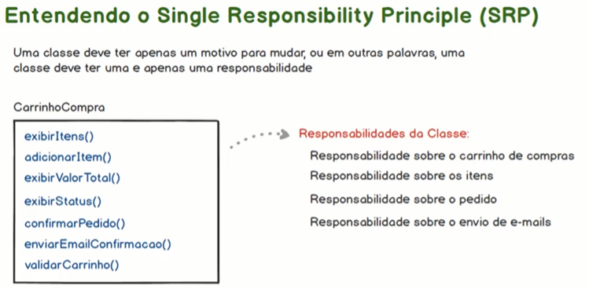

# SOLID - Os 5 Princípios para as Boas Práticas da POO

https://www.udemy.com/course/solid-os-5-principios-para-as-boas-praticas-da-poo/


## <a name="indice">Índice</a>

1. [Introdução](#parte1)     
2. [SRP - Single Responsibility Principle (Princípio da Responsabilidade Única)](#parte2)     
3. [Extra - Implementando testes de unidade automatizados](#parte3)     
4. [OCP - Open/Closed Principle (Princípio Aberto/Fechado)](#parte4)     
5. [LSP - Liskov Substitution Principle (Princípio de Substituição de Liskov)](#parte5)     
6. [ISP - Interface Segregation Principle (Princípio da Segregação de Interface)](#parte6)     
7. [DIP - Dependency Inversion Principle (Princípio da Inversão de Dependência)](#parte7)     
---


## <a name="parte1">1 - Introdução</a>

### O que é o SOLID?



 

### Como vai o seu código?


### Canais de comunicação

[Voltar ao Índice](#indice)

---


## <a name="parte2">2 - SRP - Single Responsibility Principle (Princípio da Responsabilidade Única)</a>

04- Iniciando o projeto Carrinho de Compras

- /projsolid1app_carrinho_compras

05 - Projeto Carrinho de Compras - Configurando o Autoloader




06 - Projeto Carrinho de Compras - Abstraindo os atributos e métodos

```php
<?php

namespace App;

class CarrinhoCompra
{
  // atributos
  private $itens;
  private $status;
  private $valorTotal;

  //métodos
  public function __construct()
  {
    $this->itens = [];
    $this->status = 'aberto';
    $this->valorTotal = 0;
  }

  public function exibirItens()
  {
    return $this->itens;
  }

  public function adicionarItens(string $item, float $valor)
  {
    array_push($this->itens, ["item" => $item, "valor" => $valor]);

    $this->valorTotal += $valor;

    return true;
  }

  public function valorTotal()
  {
    return $this->valorTotal;
  }

  public function exibirStatus()
  {
    return $this->status;
  }

  public function confirmarPedido()
  {
    if ($this->validarCarrinho()) {
      $this->status = 'CONFIRMADO';
      $this->enviarEmailConcirmacao();
      return true;
    } else {
      return false;
    }
  }

  public function enviarEmailConcirmacao()
  {
    echo "<br>...enviando email de confirmação<br>";
  }

  public function validarCarrinho()
  {
    return count($this->itens) > 0;
  }

}
```

```php
<?php

use App\CarrinhoCompra;

require __DIR__ . "/vendor/autoload.php";


$carrinho1 = new CarrinhoCompra();
print_r($carrinho1->exibirItens());
echo "<br> Valor Total: " . $carrinho1->valorTotal();

/*$carrinho1->adicionarItens('Bicicleta', 99.9);
$carrinho1->adicionarItens('Patins', 40.9);
$carrinho1->adicionarItens('Patinente', 59.7);*/

echo "<br>";
print_r($carrinho1->exibirItens());
echo "<br> Valor Total: " . $carrinho1->valorTotal();
echo "<br> Status " . $carrinho1->exibirStatus();

if ($carrinho1->confirmarPedido()) {
  echo "<br>PEDIDO REALIZADO COM SUCESSO<br>";
}else{
  echo "<br>ERRO na confirmação do pedido. Carrinho não possui itens<br>";
}
echo "<br> Status " . $carrinho1->exibirStatus();

```

07 - Entendendo o Single Responsibility Principle (SRP)



08 - Refactoring do Projeto - Aplicando o princípio na prática parte 1

09 - Refactoring do Projeto - Aplicando o princípio na prática parte 2

10 - Refactoring do Projeto - Aplicando o princípio na prática parte 3

11 - Testando as vantagens do SRP


[Voltar ao Índice](#indice)

---


## <a name="parte3">3 - Extra - Implementando testes de unidade automatizados</a>


[Voltar ao Índice](#indice)

---


## <a name="parte4">4 - OCP - Open/Closed Principle (Princípio Aberto/Fechado)</a>


[Voltar ao Índice](#indice)

---


## <a name="parte5">5 - LSP - Liskov Substitution Principle (Princípio de Substituição de Liskov)</a>


[Voltar ao Índice](#indice)

---


## <a name="parte6">6 - ISP - Interface Segregation Principle (Princípio da Segregação de Interface)</a>


[Voltar ao Índice](#indice)

---


## <a name="parte7">7 - DIP - Dependency Inversion Principle (Princípio da Inversão de Dependência)</a>


[Voltar ao Índice](#indice)

---

