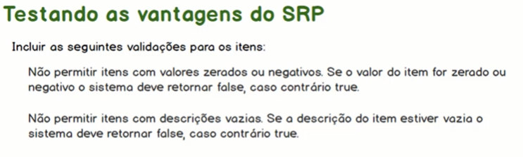
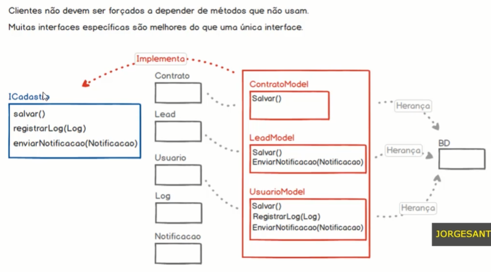
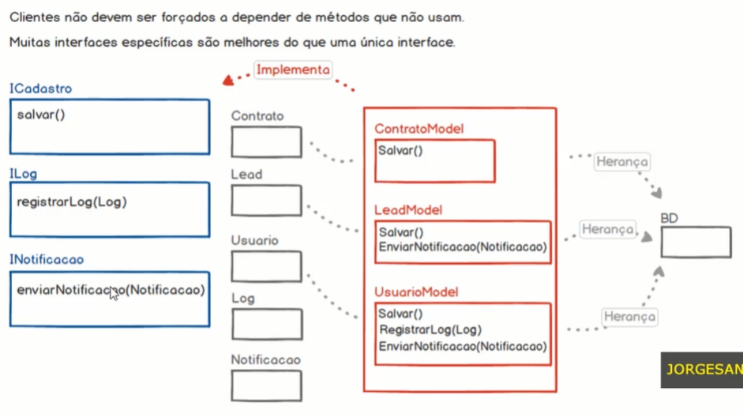

# SOLID - Os 5 Princípios para as Boas Práticas da POO

https://www.udemy.com/course/solid-os-5-principios-para-as-boas-praticas-da-poo/


## <a name="indice">Índice</a>

1. [Introdução](#parte1)     
2. [SRP - Single Responsibility Principle (Princípio da Responsabilidade Única)](#parte2)     
3. [Extra - Implementando testes de unidade automatizados](#parte3)     
4. [OCP - Open/Closed Principle (Princípio Aberto/Fechado)](#parte4)     
5. [LSP - Liskov Substitution Principle (Princípio de Substituição de Liskov)](#parte5)     
6. [ISP - Interface Segregation Principle (Princípio da Segregação de Interface)](#parte6)     
7. [DIP - Dependency Inversion Principle (Princípio da Inversão de Dependência)](#parte7)     
---


## <a name="parte1">1 - Introdução</a>

### O que é o SOLID?


 

### Como vai o seu código?


### Canais de comunicação

[Voltar ao Índice](#indice)

---


## <a name="parte2">2 - SRP - Single Responsibility Principle (Princípio da Responsabilidade Única)</a>

04- Iniciando o projeto Carrinho de Compras

- /projsolid1app_carrinho_compras

05 - Projeto Carrinho de Compras - Configurando o Autoloader


06 - Projeto Carrinho de Compras - Abstraindo os atributos e métodos

```php
<?php

namespace App;

class CarrinhoCompra
{
  // atributos
  private $itens;
  private $status;
  private $valorTotal;

  //métodos
  public function __construct()
  {
    $this->itens = [];
    $this->status = 'aberto';
    $this->valorTotal = 0;
  }

  public function exibirItens()
  {
    return $this->itens;
  }

  public function adicionarItens(string $item, float $valor)
  {
    array_push($this->itens, ["item" => $item, "valor" => $valor]);

    $this->valorTotal += $valor;

    return true;
  }

  public function valorTotal()
  {
    return $this->valorTotal;
  }

  public function exibirStatus()
  {
    return $this->status;
  }

  public function confirmarPedido()
  {
    if ($this->validarCarrinho()) {
      $this->status = 'CONFIRMADO';
      $this->enviarEmailConcirmacao();
      return true;
    } else {
      return false;
    }
  }

  public function enviarEmailConcirmacao()
  {
    echo "<br>...enviando email de confirmação<br>";
  }

  public function validarCarrinho()
  {
    return count($this->itens) > 0;
  }

}
```

```php
<?php

use App\CarrinhoCompra;

require __DIR__ . "/vendor/autoload.php";


$carrinho1 = new CarrinhoCompra();
print_r($carrinho1->exibirItens());
echo "<br> Valor Total: " . $carrinho1->valorTotal();

/*$carrinho1->adicionarItens('Bicicleta', 99.9);
$carrinho1->adicionarItens('Patins', 40.9);
$carrinho1->adicionarItens('Patinente', 59.7);*/

echo "<br>";
print_r($carrinho1->exibirItens());
echo "<br> Valor Total: " . $carrinho1->valorTotal();
echo "<br> Status " . $carrinho1->exibirStatus();

if ($carrinho1->confirmarPedido()) {
  echo "<br>PEDIDO REALIZADO COM SUCESSO<br>";
}else{
  echo "<br>ERRO na confirmação do pedido. Carrinho não possui itens<br>";
}
echo "<br> Status " . $carrinho1->exibirStatus();

```

07 - Entendendo o Single Responsibility Principle (SRP)


08 - Refactoring do Projeto - Aplicando o princípio na prática parte 1


09 - Refactoring do Projeto - Aplicando o princípio na prática parte 2

[projsolid1app_carrinho_compras_b](projsolid1app_carrinho_compras_b)

10 - Refactoring do Projeto - Aplicando o princípio na prática parte 3

11 - Testando as vantagens do SRP



[Voltar ao Índice](#indice)

---


## <a name="parte3">3 - Extra - Implementando testes de unidade automatizados</a>

12 - O que são os testes de software?


13 - Incluindo o PHPUnit no projeto via Composer

```
$ composer require --dev --prefer-dist phpunit/phpunit ^9.0
```

14 - Implementando nosso primeiro teste

15 - Testes e Asserções

```php
<?php

namespace test;

use App\Item;
use PHPUnit\Framework\TestCase;

class ItemTest extends TestCase
{
//  public function testEstouFuncionando()
//  {
//    $valor = 10;
//    $this->assertEquals($valor, 10);
//  }
  public function testEstadoInicialItem()
  {
    $item = new Item();
    // asserções do PHPUnit
    $this->assertEquals('', $item->getDescricao());
    $this->assertEquals(0, $item->getValor());
  }

  public function testGetDescricao()
  {
    $descricao = 'Cadeira de plástico';
    $item = new Item();
    $item->setDescricao($descricao);
    $this->assertEquals($descricao, $item->getDescricao());
  }

  public function testGetValor()
  {
    $valor = 35.99;
    $item = new Item();
    $item->setValor($valor);
    $this->assertEquals($valor, $item->getValor());
  }

  public function testItemValido()
  {
    $item = new Item();
    // seria submeter um item válido para o teste e retornar ok
    $item->setValor(55);
    $item->setDescricao('Cadeira de plastico');
    $this->assertEquals(true, $item->itemValido());

    // seria submeter um item inválido para o teste e retornar false(descricao)
    $item->setValor(55);
    $item->setDescricao('');
    $this->assertEquals(false, $item->itemValido());

    // seria submeter um item inválido par ao teste e retornar false(valor)
    $item->setValor(0);
    $item->setDescricao('Cadeira de plastico');
    $this->assertEquals(false, $item->itemValido());

    $item->setValor(0);
    $item->setDescricao('');
    $this->assertEquals(false, $item->itemValido());
  }
}
```

```
Testing started at 6:30 PM ...
PHPUnit 9.5.27 by Sebastian Bergmann and contributors.

....                               4 / 4 (100%)

Time: 00:00.041, Memory: 4.00 MB

OK (4 tests, 8 assertions)

Process finished with exit code 0
```


16 - Criando um provedor de dados para testes

```php
  /**
   * @dataProvider dataValores
   * */
  public function testGetSetValor($valor)
  {
    // $valor = 35.99;
    $item = new Item();
    $item->setValor($valor);
    $this->assertEquals($valor, $item->getValor());
  }

  public function dataValores()
  {
    return [
      [100],
      [-2],
      [0],
      [5],
    ];
  }
```

```
Testing started at 6:40 PM ...
PHPUnit 9.5.27 by Sebastian Bergmann and contributors.

....                                                                4 / 4 (100%)

Time: 00:00.016, Memory: 4.00 MB

OK (4 tests, 4 assertions)

Process finished with exit code 0
```

[Voltar ao Índice](#indice)

---


## <a name="parte4">4 - OCP - Open/Closed Principle (Princípio Aberto/Fechado)</a>

17 - Iniciando o projeto ETL (Extract Transform Load)


- (app_etl)[app_etl]

18 - Projeto ETL - Lendo um arquivo CSV


19 - Projeto ETL - Lendo um arquivo TXT

20 - Entendendo o Open/Closed Principle (OCP)


21 - Refactoring do Projeto - Aplicando o princípio na prática


22 - Testando as vantagens do OCP


[Voltar ao Índice](#indice)

---


## <a name="parte5">5 - LSP - Liskov Substitution Principle (Princípio de Substituição de Liskov)</a>

- 23 Iniciando o projeto Polígonos


- [app_poligonos](app_poligonos)

- 24 Projeto Polígonos - Retângulo e Quadrado


- 25 Projeto Polígonos - Testando a Substituição de Tipos


- 26 Entendendo o Liskov Substituion Principal


- 27 Refactoring do Projeto - Aplicando o princípio na prática

[Voltar ao Índice](#indice)

---


## <a name="parte6">6 - ISP - Interface Segregation Principle (Princípio da Segregação de Interface)</a>

- 28 Iniciando o Projeto CRM

[app_crm](app_crm)

- 29 Projeto CRM - Implementando os componentes da aplicação


- 30 Projeto CRM - Implementando a interface

- 31 Entendendo o Interface Segregation Principle



- 32 Refactoring do Projeto - Aplicando o princípio na prática



[Voltar ao Índice](#indice)

---


## <a name="parte7">7 - DIP - Dependency Inversion Principle (Princípio da Inversão de Dependência)</a>

- 33 Iniciando o Projeto Mensageiro

[app_mensageiro](app_mensageiro)

- 34 Projeto Mensageiro parte 1 - Implementando os componentes da aplicação


- 35 Projeto Mensageiro parte 2 - Implementando os componentes da aplicação

- 36 Entendendo o Dependency Inversion Principle

- 37 Refactoring do Projeto - Aplicando o princípio na prática


[Voltar ao Índice](#indice)

---

